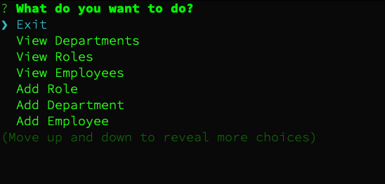

# Employee Management CLI Tool
<div id="top"></div>

<!-- TABLE OF CONTENTS -->
<details>
  <summary>Table of Contents</summary>
  <ol>
    <li>
      <a href="#about-the-project">About The Project</a>
      <ul>
        <li><a href="#built-with">Built With</a></li>
      </ul>
    </li>
    <li>
      <a href="#getting-started">Getting Started</a>
      <ul>
        <li><a href="#prerequisites">Prerequisites</a></li>
        <li><a href="#installation">Installation</a></li>
      </ul>
    </li>
    <li><a href="#usage">Usage</a></li>
    <li><a href="#contact">Contact</a></li>

  </ol>
</details>


<!-- ABOUT THE PROJECT -->
## About The Project



This class project is to create a CLI tool with Node.js that displays general employee data with a MySQL DB.

About:
* The tool allows for a manager to view departments, roles and employees as well as add additional
* The tools can update existing employees roles 
* The tool is CLI controlled with a MySQL DB


<p align="right">(<a href="#top">back to top</a>)</p>


### Built With

* [Node.js](https://nodejs.dev/)
* [Inquirer.js](https://www.npmjs.com/package/inquirer)
* [Mysql2](https://www.npmjs.com/package/mysql2)
* [console.table](https://www.npmjs.com/package/console.table)


<p align="right">(<a href="#top">back to top</a>)</p>


<!-- GETTING STARTED -->
## Getting Started

To get a local copy up and running follow these simple example steps.

### Prerequisites

* npm
  ```sh
  npm install npm@latest -g
  ```
* mysql -- see [downloads](https://www.mysql.com/downloads/)


### Installation

1. Clone this repo 
```sh
git clone git@github.com:anon123123123/du-employee-tracker-proj-10.git
```
2. Install NPM packages
   ```sh
   cd du-employee-tracker-proj-10 && npm install
   ```
3. Ensure mysql service is running
4. Update the MySQL password to your own in the {{this project repo folder}}/db/db_handler.js file


<p align="right">(<a href="#top">back to top</a>)</p>


<!-- USAGE EXAMPLES -->
## Usage

Once installed run `npm start` and follow the interactive command prompts. The update fields are ID bases so ensure to enter the correct employee ID and role ID.

_For more examples, please refer to the [VIDEO](https://youtu.be/4fQXyLhxLQ0)_


<p align="right">(<a href="#top">back to top</a>)</p>


<!-- CONTACT -->
## Contact

Project Link: [https://github.com/anon123123123/du-employee-tracker-proj-10](https://github.com/anon123123123/du-employee-tracker-proj-10)

<p align="right">(<a href="#top">back to top</a>)</p>


